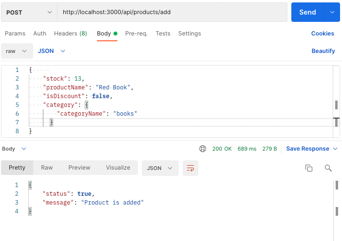

# A101 Bootcamp Homework 3

This repo is created by [Egemen Kar](https://github.com/egemenkar) for the third homework assignment of the [A101 Node.js & TypeScript Amazon Lambda & DynamoDB](https://www.patika.dev/bootcamp/a101-amazon-lambda-dynamodb-bootcamp-node-js-typescript-programi) bootcamp.

## Instructions

### A→

- 1. Write a POST endpoint that adds products to the Products table.
     Fields that should be in the product table;

```
{
  productId: string',
  stock: number,
  productName: string,
  isDiscount: boolean,
  category: {
  categoryId: number,
  categoryName: string,
  }
}
```

- 2. Write a GET endpoint that returns all added products.

  - 2a) A filter will be created by using query params according to productId among all products.
    Enter the endpoint.
  - 2b) There is a filter among all products that will filter according to the discounted products.
    Enter the endpoint.

- 3. Write a DELETE endpoint that will delete any product with its productId (on
     Any product with isDiscount should not be deleted, an error should be returned)

- 4. Write an UPDATE service that will change the stock of any product.

### B→ Also write an article explaining the differences between NoSQL and SQL.

## Installation

Run:

```bash
npm install
```

## Deployment

Run:

```
npx nodemon index.js
```

or

```
node index.js
```

or

```
nodemon index.js
```

## Technologies Used

- Node.js
- Express
- Axios

## A →

All the endpoints are created.

## Previews

- Write a POST endpoint that adds products to the Products table.



- Write a GET endpoint that returns all added products.


A filter will be created by using query params according to productId among all products.


There is a filter among all products that will filter according to the discounted products.


- Write a DELETE endpoint that will delete any product with its productId (on
  Any product with isDiscount should not be deleted, an error should be returned)

with discount


without discount


- Write an UPDATE service that will change the stock of any product.


## B → SQL Databases vs NoSQL DAtabases

SQL databases use structured query language and have a pre-defined schema for defining and manipulating data. SQL is one of the most versatile and widely used query languages available, making it a safe choice for many use cases. It’s perfect for complex queries. However, SQL can be too restrictive. You have to use predefined schemas to determine your data structure before you can work with it. All of your data must follow the same structure. This process requires significant upfront preparation. If you ever wanted to change your data structure, it would be difficult and disruptive to your whole system.

NoSQL databases have dynamic schemas for unstructured data, and the data is stored in many ways. You can use column-oriented, document-oriented, graph-based, or KeyValue store for your data. This flexibility means that:

- You can create documents without having to first define their structure
- Each document can have its own unique structure
- The syntax can vary from database to database
- You can add fields as you go

## Important differences

- SQL databases are relational, NoSQL databases are non-relational.
- SQL databases use structured query language and have a predefined schema. NoSQL databases have dynamic schemas for unstructured data.
- SQL databases are vertically scalable, while NoSQL databases are horizontally scalable.
- SQL databases are table-based, while NoSQL databases are document, key-value, graph, or wide-column stores.
- SQL databases are better for multi-row transactions, while NoSQL is better for unstructured data like documents or JSON.

## Licence

[MIT.](license)
